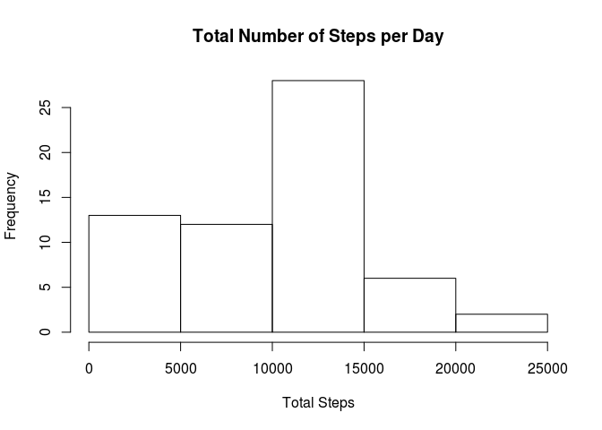
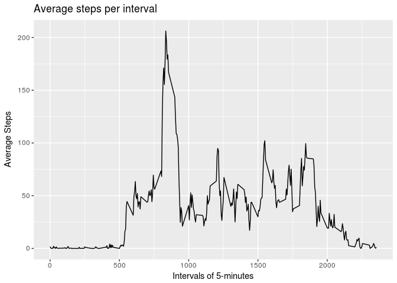
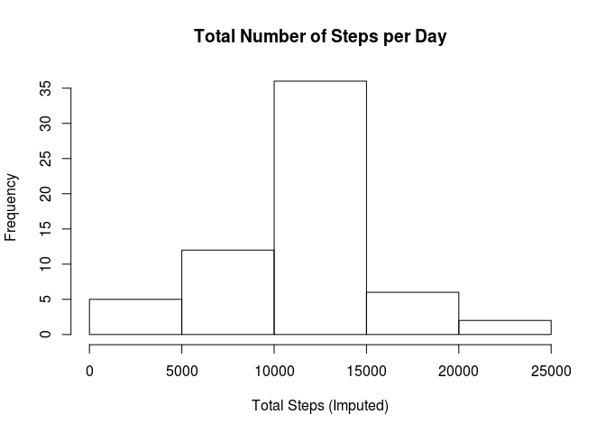
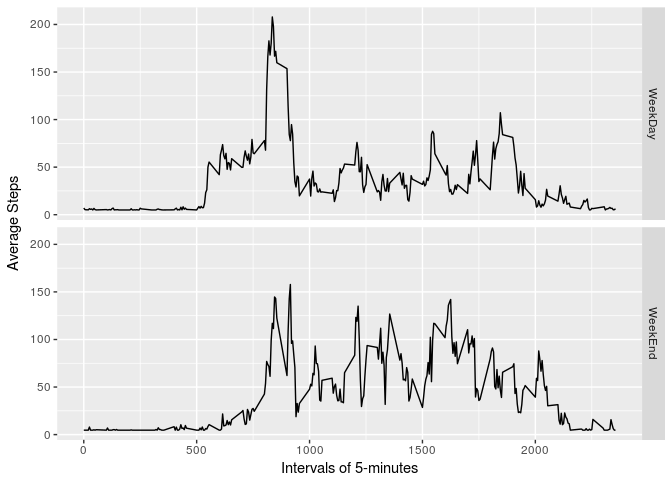

## Loading and preprocessing the data

#### 1. Loading and taking a look at the data


```r
activity <- read.csv("activity.csv", header = TRUE)
head(activity)
```

```
##   steps       date interval
## 1    NA 2012-10-01        0
## 2    NA 2012-10-01        5
## 3    NA 2012-10-01       10
## 4    NA 2012-10-01       15
## 5    NA 2012-10-01       20
## 6    NA 2012-10-01       25
```

```r
str(activity)
```

```
## 'data.frame':	17568 obs. of  3 variables:
##  $ steps   : int  NA NA NA NA NA NA NA NA NA NA ...
##  $ date    : Factor w/ 61 levels "2012-10-01","2012-10-02",..: 1 1 1 1 1 1 1 1 1 1 ...
##  $ interval: int  0 5 10 15 20 25 30 35 40 45 ...
```

#### 2. Preprocessing the date in correct format

The date column is not proper date format, so formatting date column as `date` format.

```r
activity[,2] <- as.Date(activity$date)
str(activity)
```

```
## 'data.frame':	17568 obs. of  3 variables:
##  $ steps   : int  NA NA NA NA NA NA NA NA NA NA ...
##  $ date    : Date, format: "2012-10-01" "2012-10-01" ...
##  $ interval: int  0 5 10 15 20 25 30 35 40 45 ...
```

## What is mean total number of steps taken per day?

Let's first club the steps taken per day in a new variable.

```r
steps_per_day <- with(activity, tapply(steps, date, sum, na.rm = TRUE))
```

Viewing steps per day in the form of a histogram.

```r
hist(steps_per_day, xlab = "Total Steps", ylab = "Frequency", main = "Total Number of Steps per Day")
```

<!-- -->

Calculating the `mean` amount of steps taken per day.

```r
print(mean(steps_per_day))
```

```
## [1] 9354.23
```

Calculating the `median` of steps taken per day.

```r
print(median(steps_per_day))
```

```
## [1] 10395
```

## What is the average daily activity pattern?

Calculating average number of steps taken, averaged across all days. 

```r
avg_steps <- aggregate(list(mean_steps = activity$steps), list(intervals = activity$interval), mean, na.rm = TRUE)
ggplot(avg_steps, aes(x = intervals, y = mean_steps)) +
    geom_line() + 
    ggtitle("Average steps per interval") +
    xlab("Intervals of 5-minutes") + 
    ylab("Average Steps")
```

<!-- -->

Finding which 5-minute intervals, on average across all the days, has the maximum number of steps. 

```r
max_steps <- avg_steps[which.max(avg_steps$mean_steps), 'intervals']
```

* Maximum steps on average are taken in 835 interval.

## Imputing missing values

Finding number of missing values.

```r
sum(is.na(activity$steps))
```

```
## [1] 2304
```

Augmenting the dataset with missing values imputed.

```r
index <- which(is.na(activity$steps))
steps_avg <- with(activity, tapply(steps, date, mean, na.rm=TRUE))
na <- mean(steps_avg, na.rm = TRUE)

for(i in 1:length(index)){
    activity[index[i], 1] <- na
}
```

Let's confirm if all the NA's are properly filled.

```r
print(sum(is.na(activity$steps)))
```

```
## [1] 0
```

Let's now again club the steps taken per day in a new variable.

```r
steps_per_day_imputed <- with(activity, tapply(steps, date, sum, na.rm = TRUE))
```

Viewing steps per day in the form of a histogram.

```r
hist(steps_per_day_imputed, xlab = "Total Steps (Imputed)", ylab = "Frequency", main = "Total Number of Steps per Day")
```

<!-- -->

Calculating the `mean` amount of steps taken per day.

```r
print(mean(steps_per_day_imputed))
```

```
## [1] 10766.19
```

Calculating the `median` of steps taken per day.

```r
print(median(steps_per_day_imputed))
```

```
## [1] 10766.19
```

## Are there differences in activity patterns between weekdays and weekends?

We need to create a new factor column in the dataset to identity if the day is a weekend or a weekday.

```r
activity <- mutate(activity, day = ifelse(weekdays(activity$date) == "Saturday" | weekdays(activity$date) == "Sunday", "WeekEnd", "WeekDay"))
activity$day = as.factor(activity$day)
str(activity)
```

```
## 'data.frame':	17568 obs. of  4 variables:
##  $ steps   : num  37.4 37.4 37.4 37.4 37.4 ...
##  $ date    : Date, format: "2012-10-01" "2012-10-01" ...
##  $ interval: int  0 5 10 15 20 25 30 35 40 45 ...
##  $ day     : Factor w/ 2 levels "WeekDay","WeekEnd": 1 1 1 1 1 1 1 1 1 1 ...
```

Plotting the activity patterns on WeekEnds and WeekDays.

```r
data_split <- aggregate(steps ~ interval + day, data = activity, mean)
ggplot(data_split, aes(x = interval, y = steps)) + 
    geom_line() + 
    facet_grid(day ~.) + 
    xlab("Intervals of 5-minutes") + 
    ylab("Average Steps")
```

<!-- -->
